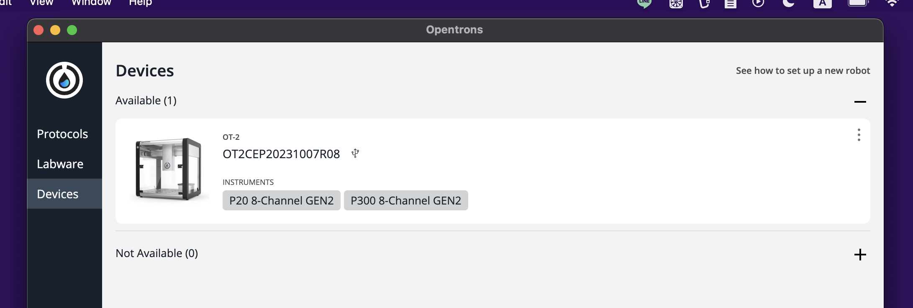
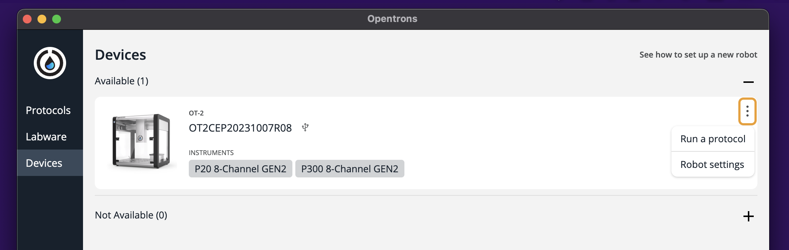
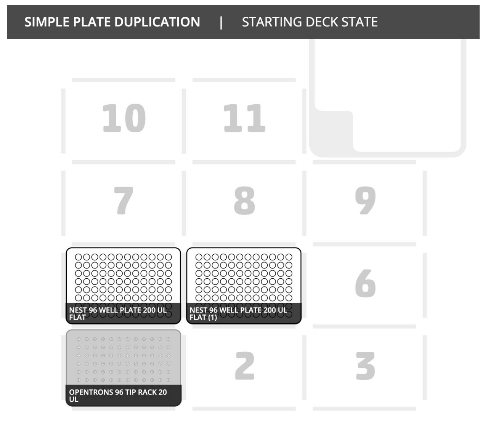
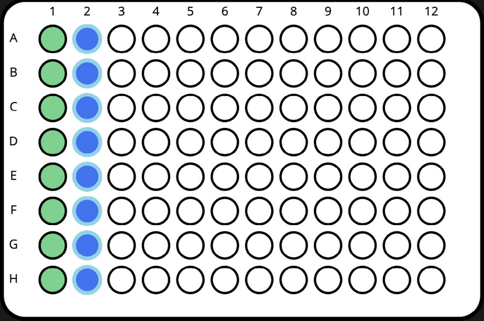

# OpenTronsAPI
[OpenTronsOT-2公式ドキュメント](https://insights.opentrons.com/hubfs/Products/OT-2/OT-2R%20User%20Manual.pdf
)
## Robotとの接続

以下キャリブレーションは完了しているものとする。

1. 背面左のスイッチをON(-)にする。
2. Heartbeat (前面左の青色ランプの点滅が点灯に変わるまで待つ)
3. HEPA moduleをONにする。
4. [OT-2](https://opentrons.com/ot-app/)を起動し、Devicesから下記のデバイスがAvailableになっていることを確認する。この時、Not availableになっている場合は、OT-2およびアプリケーション共に再起動する。

5. デバイスのプレビュー画像をクリックし、下記画面に移動する。
   

6. Lightsトグルからライトの点灯を確認する。(ライト点灯は接続チェックを兼ねる。)

## プロトコルの作成

### API情報の確認

1. [OpenTrons公式サイト](https://docs.opentrons.com/v2/versioning.html)でAPIバージョンを確認する。本ドキュメントではAPIバージョンを2.11に固定する。
   
2. [OpenTronsLabwares](https://labware.opentrons.com/)からチップのAPIでの名称の確認等を行う。

### セルの名称と位置

ロボットアームの移動は下記のように大きく12区画に分割されており、API呼び出し時に区画を番号で指定する必要がある。

また、チップの位置も下記のように定義されている。

### 
