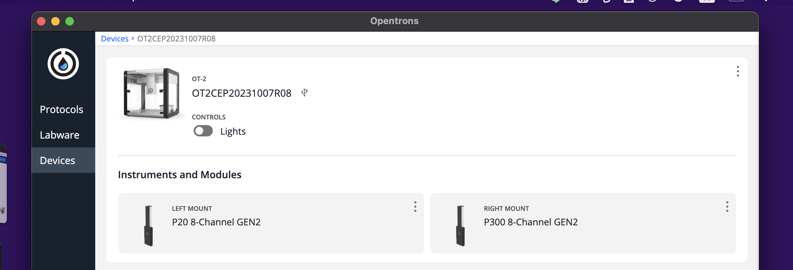

# OpenTronsAPI
[OpenTronsOT-2公式ドキュメント](https://insights.opentrons.com/hubfs/Products/OT-2/OT-2R%20User%20Manual.pdf
)

## Robotとの接続

1. 背面左のスイッチをON(-)にする。
2. Heartbeat (前面左の青色ランプの点滅が点灯に変わるまで待つ)
3. HEPA moduleをONにする。
4. [OT-2](https://opentrons.com/ot-app/)を起動し、Devicesから下記のデバイスがAvailableになっていることを確認する。この時、Not availableになっている場合は、OT-2およびアプリケーション共に再起動する。


5. デバイスのプレビュー画像をクリックし、下記画面に移動する。
   


6. Lightsトグルからライトの点灯を確認する。(ライト点灯は接続チェックを兼ねる。)


## キャリブレーション

5分程度で終わるため、実験ごとに行った方が良い。

1. はじめにRobot settingsを開く。


2. `Launch caliration` を選択する。


3. 下記画面から`left mount`を選択する。


## プロトコルの作成

**本項の最終目標は区画1に配置した300 µLチップを使用して、区画2の溶液を区画3のマイクロプレートに分注し、最後にチップを区画12にドロップすることである。**

### API情報の確認

1. [OpenTrons公式サイト](https://docs.opentrons.com/v2/versioning.html)でAPIバージョンを確認する。本ドキュメントではAPIバージョンを2.11に固定する。
   
2. [OpenTronsLabwares](https://labware.opentrons.com/)からチップのAPIでの名称の確認等を行う。

今回使用するメタデータは以下のように定義する。

```Python

from typing import Annotated, Literal

PipetteType: str = Annotated[str, Literal["p20_multi_gen2", "p300_multi_gen2"]]

metadata: dict[str, str] = {
    "protocolName": "OT-2 Basic Protocol",
    "author": "ikeda042",
    "description": "Basic Protocol for testing",
}

requirements: dict[str, str] = {"robotType": "OT-2", "apiLevel": "2.11"}
```

### セルの名称と位置

ロボットアームの移動は下記のように大きく12区画に分割されており、API呼び出し時に区画を番号で指定する必要がある。


また、チップの位置も下記のように定義されている。


### チップラックの配置

今回は下記のように区画1に`300µL Tip Rack`を配置する。


ここで、ロボットアームに取り付けられたPipetteTypeを下記画面から確かめる。今回は、`300µL Tip Rack`に対応するタイプは`P300 8-channel GEN2`であるため、`Right Mount`を使用して操作を行う。


## SSHでの接続

有線接続の場合はUSBを、Wi-Fi接続の場合はワイヤレスネットワーク（ローカル)を通してSSH接続を行える。

### 公開鍵認証

1. 下記コマンドでSSHキーペアを作成する。

```bash
ssh-keygen -f ot2_ssh_key
```

2. 下記コマンドで公開鍵を確認する。

```bash
cat ot2_ssh_key.pub
```

3. CurlでOT-2に公開鍵を登録する。デフォルトポートは31950

```bash
curl \
-H 'Content-Type: application/json' \
-d "{\"key\":\"$(cat ot2_ssh_key.pub)\"}" \
ROBOT_IP:31950/server/ssh_keys
```

4. ローカルIPアドレスを指定してSSH接続する。

```bash
ssh -i ot2_ssh_key root@ROBOT_IP
```

## 接続元のIPアドレスの確認

SSH接続後に下記を実行することで、接続元のIPアドレスがわかる。

```bash
echo $SSH_CLIENT
```
## サードパーティモジュールの導入

SSHを使用して新規pythonモジュールを導入する。

1. 下記コマンドでローカル環境に必要モジュールをダウンロードする。

```Bash
pip download requests
```
2. SCPを使用してOT-2サーバーにモジュールを転送する。

```Bash
scp -O -i ot2_ssh_key *.whl root@169.254.216.225:/tmp/
```

3. OT-2に接続し、pythonモジュールをインストールする.

```bash
ssh -i ot2_ssh_key root@169.254.216.225
cd /tmp
pip install certifi*.whl
```
